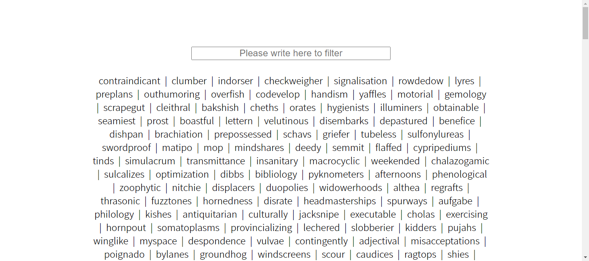
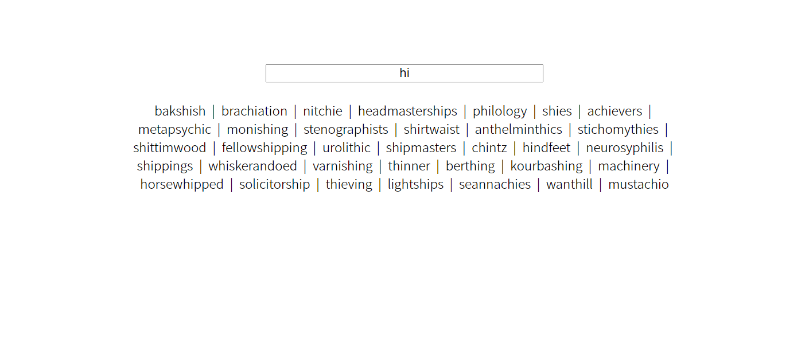
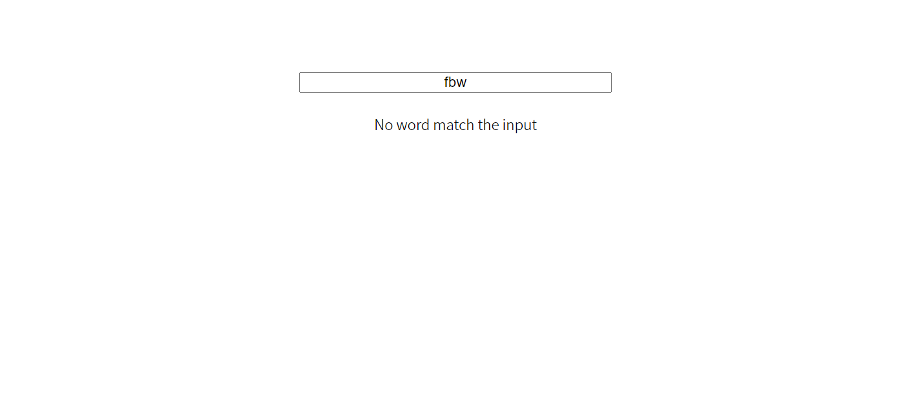

# Filter word
In the repository, there is an `index.html` starting file which has an input and a list of words. The goal of this task is to use the input to filter the list of words. Also show a message showing what happened, if the word was not a word in the array with the required characters. There is also a `style.css` file with some classes, feel free to add more. Also an `index.js` and a `words.js` file for you to start there. If needed a more detailed explanation is found in the instructions. Also some images showing the end result.

## Important Concepts
- document.querySelector("selector"). This method returns an element from the html document that match the selector that you pass inside the parentheses.[more info here](https://developer.mozilla.org/en-US/docs/Web/API/Document/querySelector)

- string.includes("characters"). This method of string type variables, search for the `"characters"` between parenthesis in the string. [More info here](https://developer.mozilla.org/en-US/docs/Web/JavaScript/Reference/Global_Objects/String/includes)

- array.forEach(function(arrayElement,indexOfElement,array)). This method of array type variables, makes a for loop in which the limit is the number of elements of the Array. The function inside the parentheses has three parameters, although not all of them are needed. [More info here](https://developer.mozilla.org/en-US/docs/Web/JavaScript/Reference/Global_Objects/Array/forEach)

- array.filter(). This method of array type variables, it returns a new array with the elements that fulfill the condition. . [More info here](https://developer.mozilla.org/en-US/docs/Web/JavaScript/Reference/Global_Objects/Array/forEach)

**Rules and indications**: 
* All changes have to be done in the JavaScript File `index.js`. No need to change the HTML. The CSS can be changed if you want to.
* The first line of the `index.js` obtain the list of words from `words.js` file. You don't need to change this line. The variable saved is called `listOfWords` and is an array with 1000 elements.

**Instructions**: 
* Select the main elements from the HTML document that will be needed for the task.
* Display the content of the variable `listOfWords` into the list. You can use a `forEach()` method to go through the array. (***HINT***: you can use addition assignment `+=` to add to a string in every loop of the `forEach` and add to a string a list item `<li></li>` with the word inside. At the end assign the string variable to the innerHTML of the list)
* Create a function for filter the array. This function will be called by the `onchange` event. 
* Inside the search function: 
  * Obtain the value of the `inputForm` and save it in a variable, called for example, inputValue.
  * Use array.filter to filter the array `listOfWords`. The conditio will be that the element from the array includes the value of the input. Save the returning array in a new variable.
  * Display the new array filtered in the list. You can follow the same process as before.

**Notes**:
* Follow the instructions to perform the task. You can add any additional styling or functionality.
* Deadline: 1hr.
* See reference images. 

